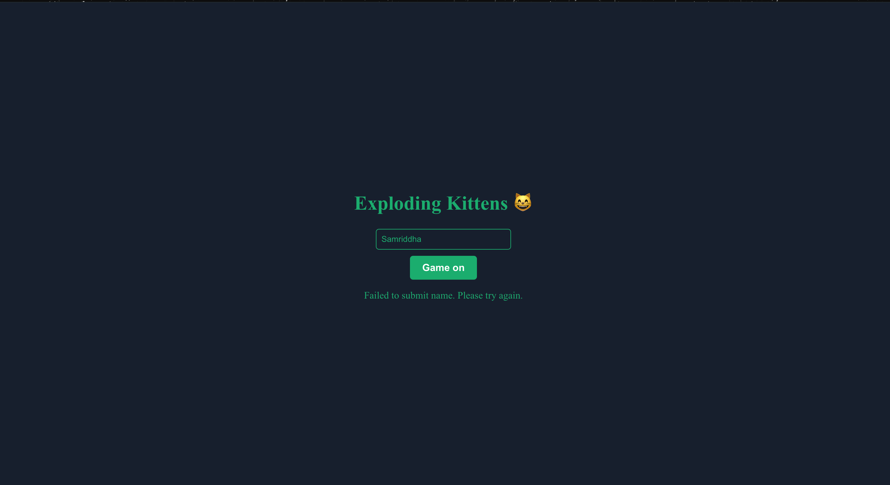
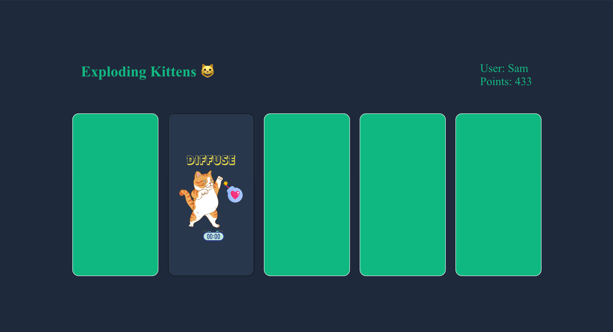
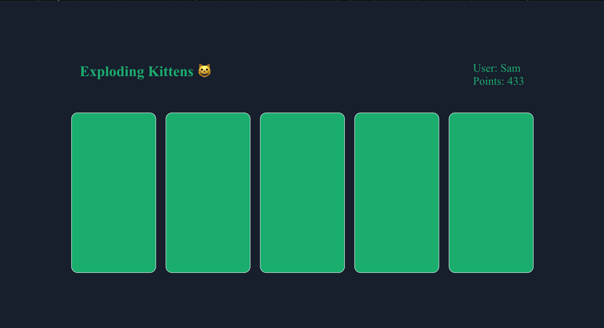
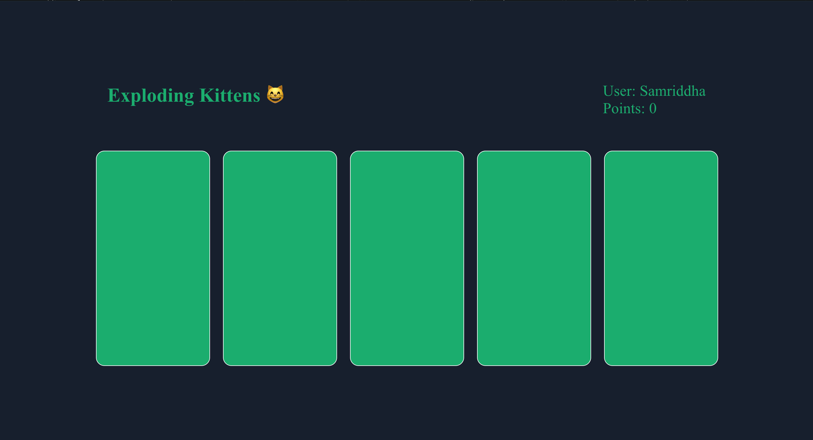
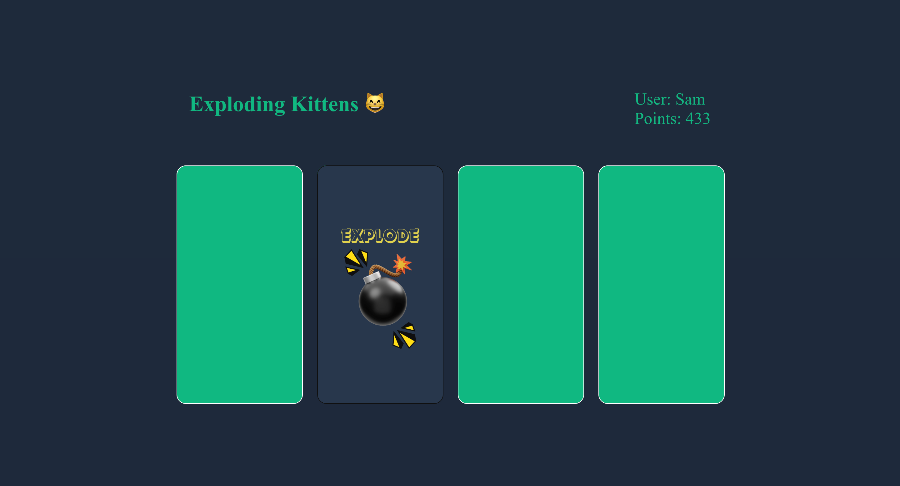
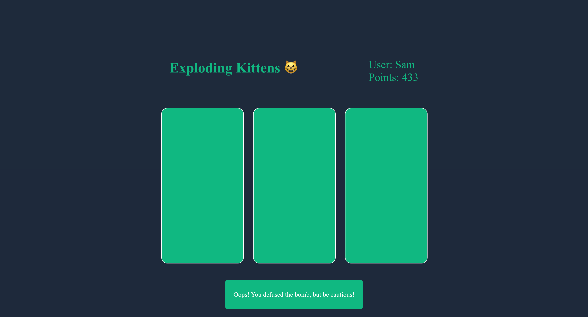
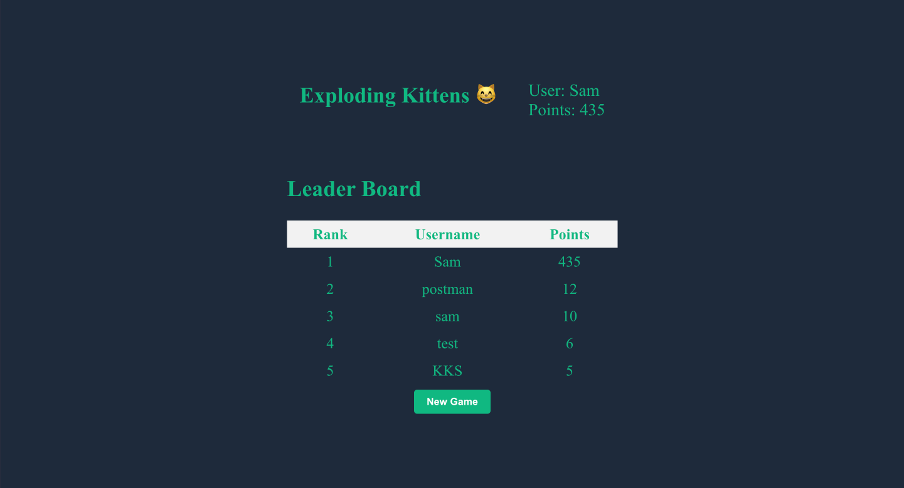
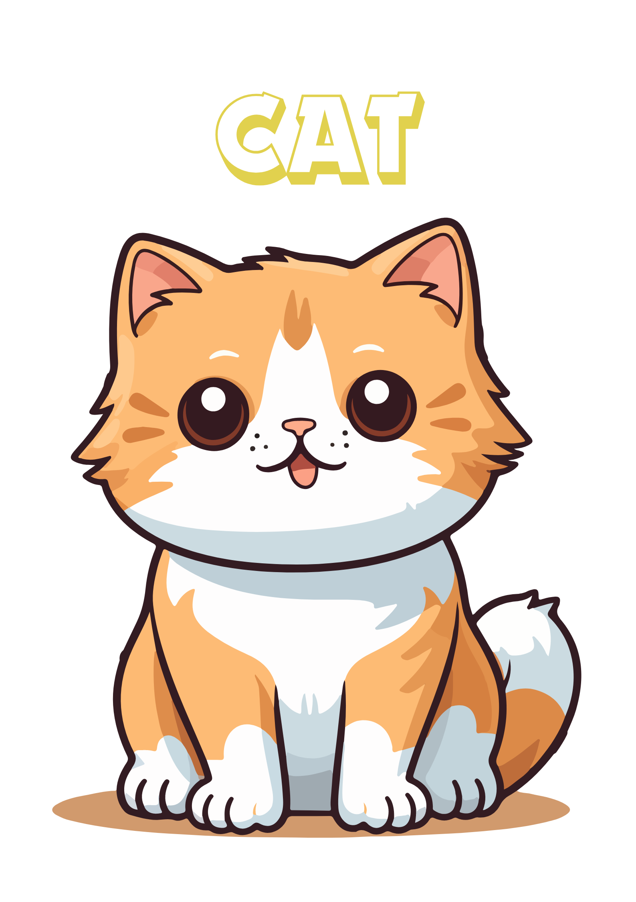
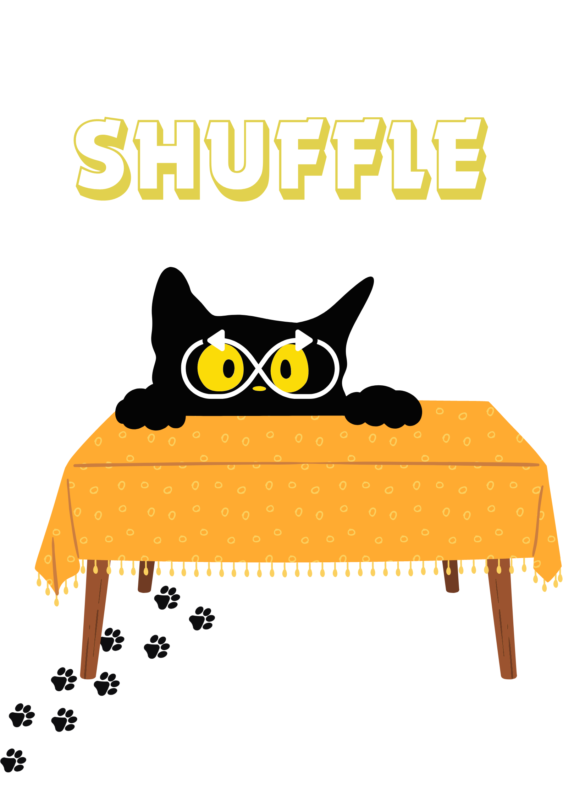
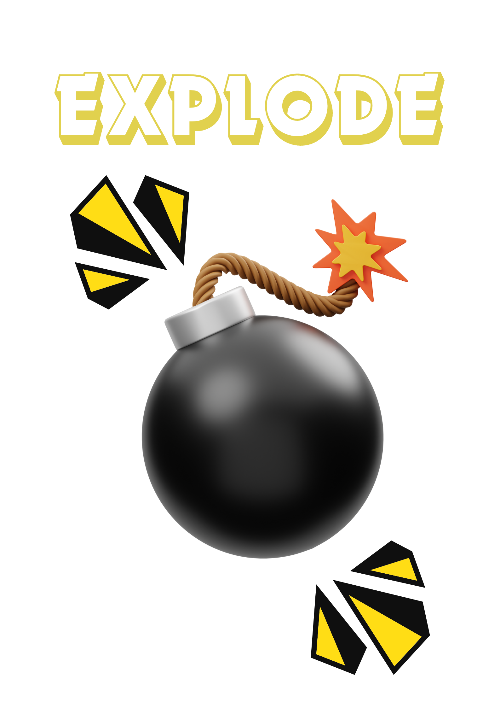

# Exploding Kittens Card Game 😼


Welcome to the Exploding Kittens card game! This is an online single-player card game where you try to draw cards from a deck without exploding kittens blowing up in your face. Let's dive into how the game works and how you can access it locally.

## Screenshots

  <div style="display: flex; flex-wrap: wrap; justify-content: space-between;">
    
    
    
    
    
    
    
    
  </div>


## Working

  <video controls height="130">
  <source src="Screenshots/gameFilm.mp4" type="video/quicktime">
    Sorry! Your browser does not support the video tag.
  </video>


## How the Game Works

### Rules:
- **Types of Cards:**
  - 😼 **Cat Card**: Harmless card, just a cute cat.
  - 🙅‍♂️ **Defuse Card**: Used to defuse an exploding kitten.
  - 🔀 **Shuffle Card**: Shuffles the deck and resets the game.
  - 💣 **Exploding Kitten Card**: Instant game over if drawn.


    
    
    
    


- **Gameplay:**
  - Clicking on the deck reveals a card.
  - If it's a cat card, it's removed from the deck.
  - If it's an exploding kitten card and you don't have a defuse card, you lose.
  - If it's a defuse card, it's removed from the deck and can be used to defuse an exploding kitten later.
  - If it's a shuffle card, the game restarts with a freshly shuffled deck.
  - Win the game by drawing all non-exploding kitten cards.

## Accessing the Game Locally

### File Directory of the Game
```
   |--exploding-kitten-frontend
   |   |-- node_modules/
   |   |-- public/
   |   |   |-- index.html
   |   |   |-- favicon.ico
   |   |   |-- manifest.json
   |   |-- src/
   |   |   |-- components/
   |   |   |   |-- CardBlock.js
   |   |   |   |-- LeaderBoard.js
   |   |   |   |--NameForm.js
   |   |   |   |-- Navbar.js
   |   |   |   |-- Toast.js
   |   |   |-- assets/
   |   |   |   |-- cat1.png
   |   |   |   |-- cat2.png
   |   |   |   |-- cat3.png
   |   |   |   |-- cat4.png
   |   |   |-- App.js
   |   |   |-- App.css
   |   |   |-- index.js
   |   |   |-- index.css
   |   |-- package.json
   |   |-- package-lock.json
   |   |-- README.md
   |--exploding-kitten-backend
   |   |--go.mod
   |   |--go.sum
   |   |--main.go
```

### For Node.js (React Frontend):
1. Install dependencies: `npm install`
2. Start the frontend server: `npm start`
3. Access the game at: `http://localhost:3000`

### For Go Lang (Backend):
1. Install dependencies: `go mod tidy`
2. Build the Go server: `go build -o main`
3. Start the server: `./main`

Sure, here are the steps to set up Redis for your project along with some example code snippets:

### For Redis DB(Backend):

#### Step 1: Install Redis

First, you need to install Redis on your system. You can download and install Redis from the official website or use package managers like `apt` or `brew` depending on your operating system.

#### Step 2: Start Redis Server

Start the Redis server on your local machine. You can do this by running the following command in your terminal:

```bash
redis-server
redis-server-start
```

This command will start the Redis server with default configurations.


#### Step 3: Close Redis Connection

Don't forget to close the Redis connection when you're done:

```bash
redis-server-stop
```
That's it! You've successfully set up Redis for your project and connected to it using Go Lang. Now you can use Redis to store and retrieve data as needed.


## Tech Stack Used
- ReactJs
- Redux
- GoLang
- Redis


## Contributions and License
This project is open for contributions. Feel free to fork the repository, make changes, and submit a pull request. There is no license specified for this project. Enjoy playing and happy coding!